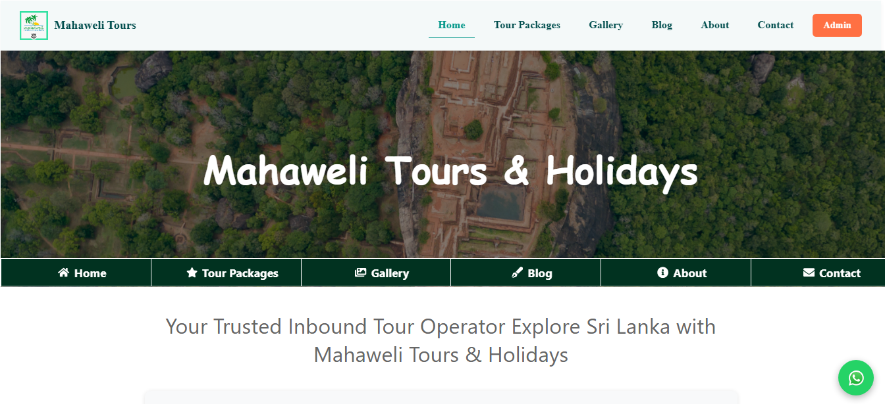

# 🏝️ Mahaweli Tours & Holidays – Tour Website

A comprehensive full-stack **tourism website** developed using **React, Node.js, Express, and MongoDB**. This project allows users to explore tour packages, view a gallery, read blog articles, and make tour inquiries. It also includes a secure **Admin Dashboard** to manage content dynamically in real-time.

---

## ✅ Features

### 🌐 Public Website
- Browse **Special Tours** and **Regular Tours** with dynamic filtering
- View **Tour Details** with descriptions, images, and pricing
- **Booking Form** integrated with EmailJS for direct inquiries
- Download detailed **Itinerary PDF** for tours using **jsPDF**
- **Floating "Book Tour"** Button on all pages for quick access
- Read engaging **Travel Blog** posts with images
- Explore a stunning **Gallery** with smooth hover image effects
- Responsive **Floating WhatsApp** button for instant contact
- Interactive **Navigation Bar** with hover effects for better UX
- View homepage stats, achievements, and highlights updated live
- Fully responsive and mobile-friendly across devices

### 🔐 Admin Panel
- Secure Admin Login with protected routes
- Add, Edit, and Delete:
    - Tour Packages (Special & Regular)
    - Blog Posts
    - Gallery Images (using GridFS for scalable image storage)
    - Homepage content (headline, intro text, visitor stats)
- Real-time content updates reflected on the public website
- Manage all floating buttons and live UI elements

---

## 🚀 Live Demo

---

## 🛠️ Technologies Used

### Frontend
- React (Functional Components, Hooks)
- React Router DOM for SPA navigation
- EmailJS for sending booking inquiries
- jsPDF for generating downloadable PDF itineraries
- CSS with inline styles and custom hover effects
- Floating WhatsApp and Book Tour buttons for UX
- Fully responsive layouts for desktop, tablet, and mobile

### Backend
- Node.js with Express.js RESTful API
- MongoDB database with Mongoose ODM
- GridFS for efficient image storage and streaming
- Multer middleware for handling image uploads
- CORS enabled for cross-origin requests
- dotenv for environment variable management

---

## 🗃️ Database Collections (MongoDB)

### 1. `tours`
| Field         | Description              |
|---------------|--------------------------|
| title         | Name of the tour         |
| location      | Tour location            |
| type          | Day Tour or Round Tour   |
| duration      | Length of the tour       |
| rating        | Rating (1–10)            |
| price         | Price per person         |
| description   | Detailed tour info       |
| image         | Image path or GridFS ID  |

### 2. `blogs`
| Field       | Description         |
|-------------|---------------------|
| title       | Blog title          |
| content     | Blog content        |
| image       | Blog image (GridFS) |

### 3. `gallery`
| Field       | Description         |
|-------------|---------------------|
| filename    | Image file name     |
| contentType | Image MIME type     |
| fileId      | GridFS ID           |

### 4. `homecontent`
| Field     | Description               |
|-----------|---------------------------|
| title     | Homepage headline         |
| intro     | Short introduction text   |
| stats     | Visitor stats/achievements|

### 5. `comments` *(optional for blog feedback)*
| Field     | Description               |
|-----------|---------------------------|
| name      | Commenter's name          |
| comment   | Comment message           |

---

## 🎯 Key Functionalities Explained

### Navigation Bar with Hover Effects
- Responsive navigation menu with smooth hover animations for links
- Dropdown submenus (if any) appear on hover with transitions
- Accessible on desktop and mobile devices

### Floating WhatsApp & Book Tour Buttons
- Persistent buttons visible on all pages
- WhatsApp button opens chat with preset message/number
- Book Tour button scrolls to booking form or opens modal for inquiries
- Stylish, unobtrusive, and user-friendly

### Booking Form & EmailJS Integration
- Users can submit tour inquiries via an easy-to-use form
- Form data sent via EmailJS to designated email for instant notifications
- Validation and feedback provided on successful submission

## Download Itinerary PDF with jsPDF
- Each tour details page includes a Download Itinerary button
- Clicking generates a well-formatted PDF with tour info and itinerary details
- PDF can be saved or printed by users directly from browser

## Gallery Image Hover Effects
- Gallery images display zoom or fade effect on hover for engagement
- Smooth CSS transitions to enhance user experience

## Admin Dashboard
- Secure login to access admin-only pages
- CRUD operations for tours, blogs, gallery images, and homepage content
- Changes persist in MongoDB and instantly reflect on the frontend

## Fully Device-Friendly
- Mobile-first responsive design
- Works seamlessly on desktop, tablet, and smartphones
- Interactive floating buttons adapt to screen size

## 🚀 Author
 **Safeeya Munawwar**
 

  
  
  
  

---

© 2025 Mahaweli Tours & Holidays | Built with ❤️ using React, Node.js, Express, and MongoDB
